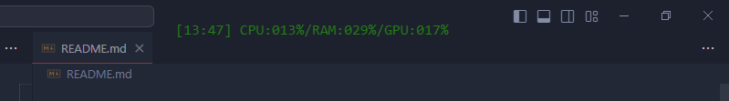

# Overlite
A small overlay that show cpu/gpu/ram usage and the current time. **Only for windows and nvidia gpu.**



## Usage
You can move the overlay by using drag and drop on it. When you're
happy with his position, you can lock it/unlock it by using <kbd>Ctrl</kbd> + <kbd>Shift</kbd> + <kbd>X</kbd>. When locked, you can't move the overlay and you can click through it.
If you want to close the overlay you can press <kbd>Ctrl</kbd> + <kbd>Shift</kbd> + <kbd>Q</kbd>. The keybinds can be changed in the config (see Customization)

## Customization
You can edit `config.yml` (stored at %appdata%\overlite). 
The default config looks like this :
```yml
ignoreMouseEventsShortcut: "CommandOrControl+Shift+X"
quitShortcut: "CommandOrControl+Shift+Q"
overlay:
  font: "monospace" # css => font-family
  color: "white" # css => color
  size: "larger" # css => font-size
  text: "[%time%] CPU:%cpu%/RAM:%ram%/GPU:%gpu%"
```
The text value is the text showed on the overlay, you can change it to whatever you want and you may include any of those placeholder :
- `%cpu%` => replaced by cpu usage in percentage (with the %)
- `%gpu%` => replaced by gpu usage in percentage (with the %)
- `%ram%` => replaced by ram usage in percentage (with the %)
- `%time%` => replaced by current time eg: `12:15`

You can change default keybind by editing `ignoreMouseEventsShortcut` or `quitShortcut`.
The format of the keybind follows : https://www.electronjs.org/docs/latest/api/accelerator.

## Building
1. Clone the repo and cd into it
2. Run `yarn install`
3. Do your changes
4. Use `yarn run start` to preview changes (with devtools)
5. Use `yarn run build` to generate the app for windows

Electron-forge forced me to use yarn but you can probably use npm or pnpm, you will have to add missing modules (npm and pnpm don't install every needed modules, do `npm i` or `pnpm i` then run the app with `npm run start` and it will tell you which modules you need to add).